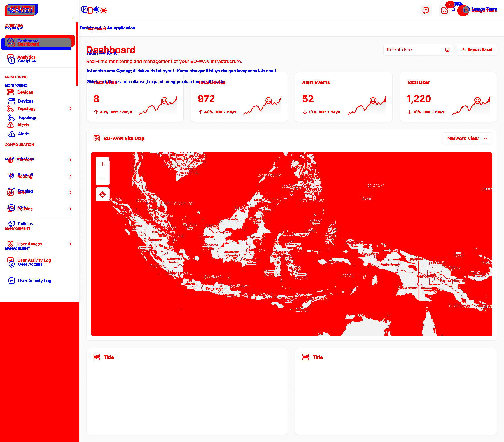

# 🧩 Pixel Perfect Tester

**Pixel Perfect Tester** adalah utilitas berbasis **TypeScript + Puppeteer + Pixelmatch** untuk menguji seberapa “pixel-perfect” hasil implementasi web kamu dibandingkan desain dari Figma (baseline image).

Tool ini secara otomatis:

1. Membuka URL target menggunakan **Puppeteer**
2. Mengambil screenshot dengan ukuran sesuai baseline Figma
3. Membandingkan hasil screenshot dengan baseline image
4. Menghasilkan **diff image** yang menandai area perbedaan
   - 🔴 **Merah** = pixel yang berbeda dari desain (hilang)
   - 🔵 **Biru** = pixel baru yang muncul di hasil implementasi
5. Menghasilkan **report JSON** berisi detail hasil perbandingan

---

## 🚀 Features

- 📸 Ambil screenshot otomatis dari URL (pakai Puppeteer)
- 🎨 Bandingkan pixel-per-pixel (pakai Pixelmatch)
- 🧠 Output visual diff image dengan warna merah & biru
- 📊 Report JSON dengan persentase perbedaan
- ⚙️ Configurable viewport & threshold

---

## 📂 Folder Structure

```
pixel-perfect-tester/
│
├── src/
│   ├── compare.ts          # Fungsi perbandingan dua gambar
│   ├── screenshot.ts       # Fungsi ambil screenshot dari URL
│   ├── index.ts            # Entry utama
│   ├── utils/              # Helper function (optional)
│   ├── config/             # Default config (optional)
│   └── tests/              # Unit tests (optional)
│
├── baseline/               # Hasil export dari Figma
├── output/                 # Hasil screenshot, diff, report.json
│
├── package.json
├── tsconfig.json
├── .prettierrc
└── README.md
```

---

## 🛠️ Instalasi

```bash
git clone https://github.com/yourusername/pixel-perfect-tester.git
cd pixel-perfect-tester
yarn install
```

> Kamu juga bisa pakai `npm install` jika tidak menggunakan Yarn.

---

## ⚙️ Menjalankan Test

### 1️⃣ Siapkan baseline dari Figma

- Export desain dari Figma sebagai `.png`
- Letakkan di folder `./baseline/`, misalnya `./baseline/dashboard.png`

### 2️⃣ Jalankan perbandingan

```bash
yarn start '<URL_PAGE_YANG_DITEST>' ./baseline/dashboard.png
```

Contoh:

```bash
yarn start 'http://localhost:6006/iframe.html?id=components-mainlayout--default&viewMode=story' ./baseline/dashboard.png
```

> ⚠️ Gunakan tanda kutip `' '` pada URL yang mengandung `&` agar shell tidak memecah argumen.

---

## 📊 Hasil Output

Setelah dijalankan, hasil akan muncul di folder `output/`:

```
output/
├── screenshot.png   # Hasil screenshot dari halaman web
├── diff.png         # Highlight perbedaan merah (hilang) & biru (baru)
└── report.json      # Ringkasan hasil perbandingan
```

Contoh `report.json`:

```json
{
  "match": false,
  "diffPixelCount": 1243,
  "diffPercentage": 0.32,
  "diffPath": "output/diff.png"
}
```

---

## 🎨 Interpretasi Diff Image

| Warna      | Arti                                                            |
| ---------- | --------------------------------------------------------------- |
| 🔴 Merah   | Bagian yang **berbeda atau hilang** dibanding desain (baseline) |
| 🔵 Biru    | Bagian yang **baru muncul** di hasil implementasi               |
| Transparan | Bagian yang **identik / tidak berubah**                         |

---

## ⚙️ Konfigurasi Opsional

Parameter default untuk `pixelmatch` bisa disesuaikan di `src/compare.ts`:

```ts
{
  threshold: 0.1,        // Sensitivitas deteksi perbedaan
  includeAA: true,       // Sertakan perbedaan anti-alias
  alpha: 0.8,            // Transparansi overlay diff
  diffColor: [255, 0, 0],   // Warna merah untuk hilang
  diffColorAlt: [0, 0, 255] // Warna biru untuk baru
}
```

---

## 🧰 Dependencies

| Library                                               | Fungsi                                   |
| ----------------------------------------------------- | ---------------------------------------- |
| [`puppeteer`](https://github.com/puppeteer/puppeteer) | Ambil screenshot halaman web             |
| [`pixelmatch`](https://github.com/mapbox/pixelmatch)  | Bandingkan dua gambar pixel-per-pixel    |
| [`pngjs`](https://github.com/lukeapage/pngjs)         | Baca & tulis file PNG                    |
| [`tsx`](https://github.com/esbuild-kit/tsx)           | Jalankan TypeScript tanpa compile manual |

---

## 🧪 Example Output



---

## 💡 Tips

- Gunakan viewport yang sama dengan ukuran export Figma agar hasil akurat.
- Hindari elemen animasi atau transition aktif (sudah otomatis dinonaktifkan di script).
- Jika diff terlalu sensitif, naikkan `threshold` di `compare.ts`.

---

## 📝 License

MIT © 2025 — Created by [Dian Ramdhani Lubis](https://github.com/dianramdhani)
